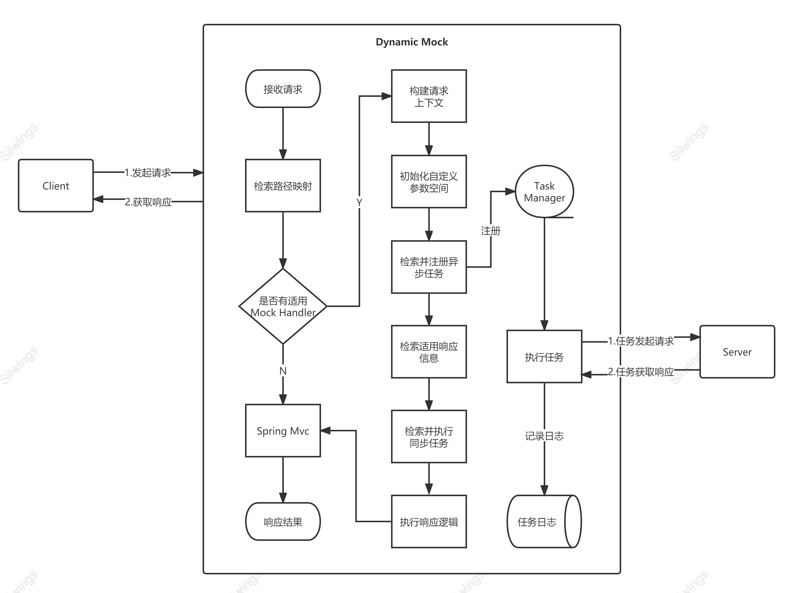

# Dynamic-Mock API 文档


## Mock Handler

Mock Handler是Dynamic-Mock中最核心的部分（以下部分地方简称处理器），每一个Dynamic-Mock代表了一个URI可响应的数据，可执行的任务的集。Mock Handler使用json格式来定义，Dynamic-Mock最终会解析定义Mock handler的json，生成一棵解析树，当符合Mock Handler基础信息中指定的uri的请求到达时，便会将请求信息封装并交给解析树解析执行，最终得到一个预期的结果。

在Web页面中，可以方便的在图形化界面上完成对Mock Handler的创建，如果熟悉结构，也可以切换编辑模式，直接编辑json数据。

**Dynamic Mock 执行流程图：**




### 整体结构

Mock hanlder包含4个部分`基础信息`,`自定义参数空间（customizeSpace）`,`响应集（responses）`,`任务集（tasks）`。

```json
{
  "name": "",
  "httpMethods": [],
  "requestUri": "",
  "label": "",
  "delayTime": 0,
  "customizeSpace": {},
  "responses": [],
  "tasks": []
}
```

#### 基础信息

基础信息一共有五个内容,其中处理器名称（name），标签(label)和处理器执行逻辑无关，只用于识别，可以将label设置为功能或模块名。

1. 适用的请求方式集（httpMethods）

   1. 和`requestUri`组合适用，规定了当前处理器可以处理的请求方式。

2. 适用的请求路径（requestUri）

   1. 通过和`httpMethods`组合，规定了当前处理器可以处理的路径。

3. 延迟执行时间（delayTime）

   1. 单位毫秒
   2. 设置当请求方式和请求路径匹配时，处理器延迟多久开始执行逻辑处理。

   

#### 自定义参数空间(customizeSpace)

在自定义空间中允许预设置一些全局的变量，提供给响应集和任务集使用，例如，需要让每次响应和任务中都包含一个相同的code值，即可让响应和任务都从自定义参数空间获取同一个key的值。

自定义空间为key:value结构，key值不允许重复。

示例：

```json
{
  "productCode": "PC001",
  "skuCodeList": [
    "SC001",
    "SC002"
  ],
  "baseUser": {
    "code": "UC001",
    "name": "Misaka Mikoto",
    "level": 5
  }
}
```


#### 响应集(responses)

响应集中声明的响应信息是最终通过Http响应给客户端的数据内容。可以在响应集中配置多个响应信息，通过条件动态判断哪一条响应信息用于最终返回，如果有多个响应信息的条件集都符合要求，优先使用第一个。响应信息中允许设置一个延迟时间，用来模拟耗时操作。

响应集及响应信息结构：

```json
[
  {
    "name": "Result Body",
    "support": [
      "1+1==2",
      "${#search('baseUser.level') >= 5}"
    ],
    "delayTime": 0,
    "response": {
      "status": 200,
      "headers": {
        "Content-Type": [
          "application/json;charset=UTF-8"
        ],
        "Date": [
          "Wed, 09 Nov 2022 21:25:02 GMT"
        ]
      },
      "body": {
        "name": "${#search('name')}",
        "age": "${#random('int',100)}"
      }
    }
  }
]
```

**字段说明：**

1. 响应名称（name）

   1. 仅用于标识

2. 适用条件集（support）

   1. 条件集中允许多个布尔表达式，只有当条件集中全部的布尔表达式结构为true时，该响应信息才能用于对应处理器的响应信息。
   2. 当集合中不包含元素时默认整体结果为true
   3. 支持***动态表达式***

3. 延迟响应时间（delayTime）

   1. 单位毫秒
   2. 设置当前响应信息适用时，延迟多久向客户端响应数据。
   3. 不支持***动态表达式***

4. 响应信息（response）：

   http的响应信息，支持***动态表达式***。

   1. HTTP响应码（status）
      1. 设置响应时的HTTP响应码
      2. 必须是数值或可转换为数值的类型
   2. HTTP响应头（headers）
      1. 设置响应时的HTTP响应头
      2. 需要注意的是，headers中的value必须是集合格式。
   3. HTTP响应体（body）
      1. 设置响应的响应体。可以是json或字符格式


#### 任务集(tasks)

任务集中可设置多个发起http请求的任务。和响应集类似，任务集中的任务也通过条件来控制是否需要触发，当条件集中的布尔表达式全部返回true时表示该任务需要执行，不同的是，任务集中满足条件的任务都会得到执行，而不是只有第一个会执行。

任务分为同步任务和异步任务两类，除了都是发起一个Http请求外，有着很大的不同。

1. 同步任务并不是一个定时任务。它会忽略cron表达式和限次参数，而是在Mock Handler的执行过程中，同步的发起一次请求，请求完成后，才会继续Mock Handler的其他逻辑处理（因此如果响应信息中设置了延迟时间，其真实延迟的时间除了Mock Handler本身的执行耗时，还需要加上任务的http请求耗时）。
2. 异步任务是定时任务。当确认执行时会被注册到定时任务管理器中，并立即开始异步执行（此时Mock handler的执行可能尚未全部完成）。定时任务中使用cron表达式指定执行周期，同时可以设置执行次数，在达到执行次数后自动关闭定时任务，当然，除了自动关闭定时任务，也可以Web页面通过任务管理手动关闭。

任务信息结构：

```json
[
  {
    "name": "Http Task",
    "support": [
      "${#equals(#search('baseUser.name','customizeSpace'),'Misaka Mikoto')}"
    ],
    "async": false,
    "cron": "* * * * * ?",
    "numberOfExecute": "1",
    "request": {
      "requestUrl": "http://localhost:8088/hello/word",
      "httpMethod": "POST",
      "headers": {
        "authToken": [
          "8888888888"
        ]
      },
      "body": {
        "timestemp": "${#now()}",
        "name": "${#search('baseUser.name')}",
        "id": "${#uuid()}"
      },
      "uriVariables": {
        "timestemp": [
          "${#now()}"
        ],
        "index": [
          "1",
          "2"
        ]
      }
    }
  }
]
```

**字段说明**

1. 任务名称（name）
   
   1. 仅用于标识
   
2. 适用条件集（support）
   1. 条件集中允许多个布尔表达式，只有当条件集中全部的布尔表达式结构为true时，该响应信息才能用于对应处理器的响应信息。
   2. 当集合中不包含元素时默认整体结果为true
   3. 支持***动态表达式***
   
3. 是否异步（async）
   1. true-异步执行，false-同步执行
   2. 仅支持布尔类型
   3. 不支持***动态表达式***
   
4. cron表达式（cron）
   1. 用于设置异步任务的执行周期
   2. 不支持***动态表达式***
   
5. 执行次数（numberOfExecute）
   1. 用于设置异步任务的执行次数
   2. 不支持***动态表达式***
   
6. 请求信息（request）
   
   请求信息部分，支持***动态表达式***
   
   1. 请求地址（requestUrl）
      1. 设置要发起请求的地址，可以不带http，会自动添加
   2. 请求方式（httpMethod）
      1. 设置发起请求的请求方式，仅支持`GET`,`POST`,`PUT`,`DELETE`
   3. 请求头（headers）
      1. 设置发起的请求的请求头，注意，value部分需要使用集合
   4. 请求体（body）
      1. 设置发起的请求的请求体
   5. URI参数（uriVariables）
      1. 设置发起的请求的URI参数，注意，value部分需要使用集合


## 动态表达式

动态表达式是一段以`${`开头,`}`结尾进行声明的文本内容，`${}`内的内容为表达式的内容。它是Mock Handler实现动态逻辑的核心，表达式在运行时基于上下文信息进行计算，不同的上下文能得到不同的结果。

动态表达式被分为函数表达式和逻辑表达式。函数表达式由函数声明和函数参数组成，例如`#search('code','customizespace')`,search为函数名，'code','customizespace'则为调用该函数时传递的两个参数。非函数表达式的的动态表达式均认为是逻辑表达式。

注意: 动态表达式中所有想表述为字符串的内容必须添加单引号`'`，如果有嵌套,需要添加转义符号，因为转义单引号与JSON存在冲突，所以在动态表达式中转义符号使用`^`，而不是`\`，使用方法一致。函数声明不需要添加字符串(因为其不表述为普通字符串)。

示例：

1. `${#search('code','customizespace')}`： code，customizespace作为search函数的字符串参数适用。

2. `${#page(1,10,100,'{"name":"Misaka Mikoto"}',false)}`：1,10,100分别作为数值类型参数，不添加单引号。`{"name":"Misaka Mikoto"}`整体作为字符串参数，需要适用单引号。false作为boolean类型的参数，不添加单引号。

3. `${#page(1,10,100,'{"name":"#search(^'code^')"}'),false}`：和上一个示例类似，不同的是json字符串中添加了search函数，作为search函数的字符串参数code，因为整个json字符串已经添加了单引号，所以code上的单引号需要添加转义符。

   **tips:**

   ​	如果直接编写MockHandler json，因为整个表达式是在json字符串内，所以双引号内容也需要转义。如果使用图形化客户端录入可以不考虑该问题。


### 逻辑运算符

1. 目前支持的逻辑运算符：
   1. `==`
   2. `!=`
   3. `>`
   4. `>=`
   5. `<`
   6. `<=`
   7. `&&`
   8. `||`
2. 在动态表达式中还支持简单的数值运算，目前支持的运算符：
   1. `+`
      1. 加法运算符和其他符号有点不同，如果加法运算符的左右两边不是数值类型，`+`将成为拼接符。
   2. `-`
   3. `*`
   4. `/`
   5. `%`

当参与逻辑运算的参数包含函数表达式时会先计算函数的结果。


### 函数

语法：

1. 函数表达式固定写法`#函数名(参数列表)`，示例：#search('code','customizespace')，#concat(1,2)，#uuid()
2. 函数名不区分大小写
3. 参数列表使用英文逗号分隔
4. 单个参数可以使用动态表达式
5. 参数中的字符类型必须添加英文单引号（即需要使用单引号声明字符串）


##### 函数列表

*以下函数说明中，参数类型限制，表示运行时的实际类型限制，并非在声明时只能使用json表示的类型。例如参数类型为Boolean，声明时可使用isBlank函数，因为isBlank函数的实际返回值类型为Boolean，符合要求。另外，对于参数类型限制为数值类型或Boolean类型的，如果运行时得到的参数不是所需类型，也会优先尝试进行类型转换。需要特别注意的是，部分函数（如Page）支持直接将声明函数时以文本录入的json格式字符串转换为json对象，这是函数的特性，并非Dynamic Mock系统的特性，需要注意区分，当函数不具备这种特性时，录入json格式字符文本，函数实际执行时得到的也是文本，非json对象。如果需要直接录入json格式字符并希望在运行时得到json对象，可以使用Search函数或ToBean函数。

##### 1.Search

​	搜索函数。用于从请求信息或自定义参数空间搜索参数信息，是最常用的函数。借助该函数可以实现通过请求信息或自定义空间中的数据控制执行逻辑，如获取分页参数，辅助page函数计算返回值，控制support条件是否成立等。

​	该函数提供五个重载形式。

   1. `#search(jsonPath,jsonObject)`

   2. `#search(jsonPath,jsonObject,defaultValue)`

          1. jsonPath，字符类型。用于指定要查询的值的路径。如果指定路径不存在将返回null。
          2. jsonObject，json类型或可转换为json的字符串。
           3. defaultValue，不限制类型。当查询结果为null时使用defaultValue返回。

   3. `#search(jsonPath)`

   4. `#search(jsonPath,SearchScope)`

   5. `#search(jsonPath,SearchScope,defaultValue)`

      1. jsonPath，字符类型。用于指定要查询的值的路径。如果指定路径不存在将返回null。

      2. defaultValue，不限制类型。当查询结果为null时使用defaultValue返回。

      3. searchScope，字符类型。用于指定查询的范围。支持`CUSTOMIZESPACE`和`REQUESTINFO`，不区分大小写，不传或值不合法时默认为`CUSTOMIZESPACE`。

         1. `CUSTOMIZESPACE`：自定义参数空间。自定义信息中的内容在创建Mock Handler是指定。

         2. `LOCALCACHE`：本地缓存。通过SaveCache函数添加缓存信息。每次请求对应的LocalCache相互独立。

         3. `REQUESTINFO`：请求信息。当有http请求到达Dynamic Mock服务，会将请求信息解析为requestInfo实例，该实例中包含这次http请求的大部分信息。requestInfo结构如下(requestInfo数据来源为HttpServletRequest)：

            ```json
            {
                "authType": "", // 授权类型
                "contextPath": "", // 上下文路径
                "cookies": [ // cookie集合，元素为Cookie实例。
                    {
                        "name":"",
                        "value":"",
                        "comment":"",
                        "path":"",
                        "domain":"",
                        "maxAge":1,
                        "secure":true,
                        "version":1
                    }
                ],
                "cookieMap":{ // cookie key-value映射
                    "key":"value"
                },
                "headers": [ // 请求头集合，请求头允许重复的key存在，如果确定不存在重复key，可以使用headerMap
                    {
                		"key":"value"
            		}
                ],
            	"headerMap":{ // 请求头key-value映射
                    "key":"value"
                },
                "method": "", // 请求方式
                "pathInfo": "", // 路径信息
                "pathTranslated": "",
                "queryString": "", // 请求字符
                "remoteUser": "",
                "requestURI": "", // 请求URI
                "requestURL": "", // 请求URL
                "servletPath": "", // servlet 路径
                "body": {}, // 请求体，根据实际请求信息可能为字符类型
                "jsonBody": {}, // Map形式类型的请求体信息
                "textBody": "",	// 文本（字符）类型的请求体信息
                "formBody": { // x-www-form-urlencoded的请求信息。注意，value的类型为集合
                    "key": [
                        "value"
                    ]
                },
                "parameterMap": { // form-data的请求信息。注意，value的类型为集合
                    "key": [
                        "value"
                    ]
                },
                "pathParameterMap": { // 路径参数的信息
                    "key":"value"
                }
            }
            ```


##### 2.Concat

​	用于将参数拼接的函数

   1. 最小参数数量：0（为0时默认为空串。）

   2. 最大参数数量：不限

   3. 参数类型限制：不限

   4. 返回值类型：String

   5. 示例：

      1. `#concat(1,2,3)` => 123

      2. `#concat('Java',' ','Good',' ','!')` => Java Good !

      3. `#concat()` => 

         

##### 3.Equals

​	比较两个参数内容转换为String后是否完全一致，可简写为`eq`。

   1. 最小参数数量：2

   2. 最大参数数量：2

   3. 参数类型限制：不限

   4. 返回值类型：Boolean

   5. 示例：

      1. `#equals(1,1)` => true

      2. `#eq(1,2)` => false

      3. `#eq(1,1-1)` => false

         

##### 4.NoEquals

​	Equals函数的取反。可简写为`neq`

   1. 最小参数数量：2
   2. 最大参数数量：2
   3. 参数类型限制：不限
   4. 返回值类型：Boolean
   5. 示例：
      1. `#noEquals(1,1)` => false
      2. `#noEquals(1,2)` => true
      3. `#neq(1,1-1)` => true

   

##### 5.IsBlank

   判断参数转换为String后是否为空或去除空白符号后长度为0（参考Java `org.apache.commons.lang3.StringUtils#isBlank`）。如果参数实际类型不是字符串，会先转换为字符串再判断

   1. 最小参数数量：0（为0时表示默认为空串。）

   2. 最大参数数量：1

   3. 参数类型限制：不限

   4. 返回值类型：Boolean

   5. 示例：

      1. `#isBlank(1)` => false
      2. `#isBlank('1 ')` => false
      3. `#isBlank('  ')` => true
      
      

##### 6.IsNotBlank

   IsBlank的取反。

   1. 最小参数数量：0（为0时表示默认为空串。）

   2. 最大参数数量：1

   3. 参数类型限制：不限

   4. 返回值类型：Boolean

   5. 示例：

      1. `#IsNotBlank(1)` => true
      2. `#IsNotBlank('1 ')` => true
      3. `#IsNotBlank('  ')` => false

      

##### 7.IsEmpty

   判断List或者Map是否没有元素，如果没有元素返回true。（参考java`org.apache.commons.collections4.CollectionUtils.isEmpty`和`org.apache.commons.collections4.MapUtils.isEmpty`）。如果参数实际类型不是List/Map，或可以转换为这两种类型的字符串，将产生异常。

   1. 最小参数数量：0（为0时表示默认为空集）

   2. 最大参数数量：1

   3. 参数类型限制：List/Map/可转换为List或Map的json字符串

   4. 返回值类型：Boolean

   5. 示例：

      1. `#IsEmpty()` => true
      2. `#IsEmpty('[1,2,3]')` => false

      

##### 8.IsNotEmpty

   IsEmpty的取反。

   1. 最小参数数量：0（为0时表示默认为空集）

   2. 最大参数数量：1

   3. 参数类型限制：List/Map/可转换为List或Map的json字符串

   4. 返回值类型：Boolean

   5. 示例：

      1. `#IsNotEmpty()` => false
      2. `#IsNotEmpty('[1,2,3]')` => true

      

##### 9.IsNull

   判空函数，判断参数是否为null，如果为null返回true，否则返回false

   `#isNull(arg)`

   1. 最新参数数量：0（为0时默认为null）
   2. 最大参数限制：1
   3. 参数类型：不限
   4. 返回值类型：Boolean
   5. 示例：
      1. `#isNull()` => true
      2. `#isNull('')` => false
      
      

##### 10.IsNotNull

   IsNull的取反

   `#isNotNull(arg)`

   1. 最新参数数量：0（为0时默认为null）

   2. 最大参数限制：1

   3. 参数类型：不限

   4. 返回值类型：Boolean

   5. 示例：
      1. `#isNotNull()` => false
      2. `#isNotNull('')` => ture
      
      
##### 11.Join

   使用分隔符连接多个参数的字符串形式，可类比 Java `java.lang.String#join(java.lang.CharSequence, java.lang.Iterable<? extends java.lang.CharSequence>)`

   `#join(delimiter，String...)`

   1. 最小参数数量：2
   2. 最大参数数量：不限
   3. 参数说明：
      1. delimiter：分隔符
      2. String...：不限数量个可转换为String的内容。
      3. Join方法的参数在运行时有点特殊，其第二个参数在声明时必须为字符类型，但如果将第二个参数声明为函数，则在运行时有可能得到的集合类型，当第二个参数是集合类型时，将遍历集合进行join。但手动声明时不支持使用`[]`声明一个集合，这样的数据会被直接视为字符串，如有需要，应当作为多个参数传递。
   4. 返回值类型：String
   5. 示例：
      1. `#join('-',1,2,3)` => 1-2-3
      2. `#join('#',1,,2,,3)` => 1##2##3
      3. `#join('',1,2,3)` => 123
      4. `#join('#',)` => 
      
      

##### 12.Now

   生成时间戳，有两个重载函数

   1. Now()
      1. 最小参数数量：0
      2. 最大参数数量：0
      3. 返回值类型：Long
      4. 示例：
         1. `#now()` => 1670154841950
   2. Now(format)
      1. 最小参数数量：1
      2. 最大参数数量：1
      3. 参数类型限制：
         
         1. 必须是有效的时间格式
      4. 返回值类型：String
      5. 示例：
         1. `#now('yyyy-MM-dd')` => 2022-12-04
         2. `#now('yyyy-MM-dd HH:mm:ss')` => 2022-12-04 20:05:25
         3. `#now('yyyy')` => 2022
         
         

##### 13.Page

   分页函数。用于动态计算页内数据条数，并自动生成对应条数的数据内容，或从指定数据集中按顺序筛选对应条数数据返回。

   该函数具有四个重载形式：

   1. 数据模板动态：#page(当前页,每页数量,总数据量,数据模板)
      1. `#page(1,2,101,'{"name":88}')`
      2. `#page(1,2,101,'Misaka Mikoto')`
      3. `#page(1,2,101,'${1+1}')`
   2. 数据模板指定是否动态：#page(当前页,每页数量,总数据量,数据模板,数据是否动态)
      1. `#page(1,2,101,'{"name":88}',true)`
      2. `#page(1,2,101,'Misaka Mikoto',false)`
      3. `#page(1,2,101,'${1+1}',true)`
   3. 数据集动态：#page(当前页,每页数量,数据集)
      1. `#page(1,10,#search('list'))`
      2. `#page(1,2,'[{"name":"Misaka Mikoto","age":14},{"name":"Misaka Mikoto","age":15},{"name":"Misaka Mikoto","age":16}]')`
      3. `#page(2,2,'[{"name":"Misaka Mikoto","age":14},{"name":"Misaka Mikoto","age":15},{"name":"Misaka Mikoto","age":"${#search(^'param^')}"}]')`
   4. 数据集指定是否动态：#page(当前页,每页数量,数据集,数据是否动态)
      1. `#page(1,2,101,'${1+1}',false)`

   其中，1和2是使用数据模板生成Mock数据的方式，3，4使用指定数据集筛选数据。1 是 2 的简写形式，如果使用1的函数，数据是否动态将默认为true。3是4的简写形式，如果使用3的函数，数据是否动态将默认为true。


​	如果分页数据模板提供的是json对象格式字符串，返回结果将尝试将其转换为对象返回，否则按照纯字符串处理。


**参数说明：**

数据模板式：

1. 当前页：指定要返回第几页的数据。可以使用search函数从请求信息中查找指定的key，得到请求信息中实际的当前页信息。
2. 每页数量：指定该页要返回的最大数据条数。可以使用search函数从请求信息中查找指定的key，得到请求信息中实际的每页数量信息。
3. 总数据量：分页数据的Total，page函数基于当前页，每页数量，总数量计算当前页在分页情况下实际有多少条数据，从而基于数据模板生成指定条数的模拟数据。
4. 数据模板：限制字符串格式，允许使用json或普通字符串形式。如果传递的是json格式数据，必须为对象类型，如果使用集合类型将产生错误。Page函数会检查数据模板是否为合法json格式，如果是将优先按照json格式解析。
5. 数据是否动态：传递true时，在实际生成Mock数据时，数据模板会被动态表达式语法解析器解析，并执行其中包含的动态表达式。

数据集合筛选式：

1. 当前页：指定要返回第几页的数据。可以使用search函数从请求信息中查找指定的key，得到请求信息中实际的当前页信息。
2. 每页数量：指定该页要返回的最大数据条数。可以使用search函数从请求信息中查找指定的key，得到请求信息中实际的每页数量信息。
3. 数据集：可以使用search函数获取运行时的集合类型数据，也可以直接使用字符串录入一个集合类型的json字符串。（注意，录入字符串被解析为json对象是Page函数自身的特性，并非Dynamic Mock的系统特性，在不具备该特性的函数中传递json格式的字符串时，得到的只会是一个字符串，而非json对象，如果需要得到json对象，应当使用Search函数从自定义空间获取运行时json对象或使用ToBean函数进行文本到对象的转换。）
4. 数据是否动态：传递true时，在实际生成Mock数据时，数据模板会被动态表达式语法解析器解析，并执行其中包含的动态表达式。


**性能说明：**

无论是基于数据模板，还是数据集，其本质都是使用数据模板生成动态数据（数据集的方式其实是有序的指定多个数据模板），所以需要在运行时进行解析，因此在对分页Mock有速度要求时，需要注意函数的选择。四种重载方式的速度对比如下（数据集动态的性能较其他差距巨大，有速度要求时慎用）：

​		快 ---> 数据模板静态 > 数据集静态 > 数据模板动态 > 数据集动态 ---> 慢


##### 14.UUID

​	生成uuid。可通过参数简单控制生成结果的长度和格式。

​	提供2个重载函数：

1. `#uuid()`
        1. 生成一个uuid
2. `#uuid(prefix,length,replace)`
       1. prefix：字符类型，生成的uuid的前缀，将在生产的uuid之前拼接prefix。允许不填该参数。
       2. length：数值类型，生成的uuid的长度，如果长度小于uuid的长度，将进行截取，如果超过uuid的长度，将用当前生成的uuid进行拼接。注意，这里指定的长度限制不包含prefix。允许不填该参数。
       3. replace：布尔类型，指定是否将uuid中的`-`替换为空白符。允许不填该参数。

示例:

1. `#uuid(,,true)` => 6c62c8fe7e8f438689c168dbcd794b8a
2. `#uuid(,10,true)` => c40c550acf
3. `#uuid(,40,true)` => 98f71914860745c4ae07bc55130e0a8898f71914
4. `#uuid('UserCode',,false)` => UserCodef6d73ae7-5c16-4152-9c04-3e9d4ef77448
5. `#uuid('UserCode',10,true)` => UserCode676d529aaa


##### 15.Random

​	随机数函数，支持生成int/long/double/boolean类型的随机数。可通过参数控制生成的随机数的范围。

   提供4个重载函数：

   1. `#random()`
      1. 生成一个int类型的随机数
   2. `#random(type)`
      1. type：字符串类型，用于指定要生成的随机数的类型。可选内容：int，long，double，boolean。不区分大小写。
   3. `#random(type,arg1)`
      1. type：字符类型，用于指定要生成的随机数的类型。可选内容：int，long，double。不区分大小写。
      2. arg1：数值类型，生成的随机数的最大值，不包含arg1本身
   4. `#random(type,arg1,arg2)`
      1. type：字符串类型，用于指定要生成的随机数的类型。可选内容：int，long，double。不区分大小写。
      2. arg1：数值类型，生成的随机数的最小值，包含arg1本身
      3. arg2：数值类型，生成的随机数的最大值，不包含arg2本身

示例:

1. `#random()`=>-962406019
2. `#random('boolean')`=>true
3. `#random('int',100)`=>62
4. `#random('int',10,20)`=>10


##### 16.Contains

​	用于判断指定字符串或集合中是否包含某个元素。当`被包含元素（集合）`存在于`集合`或指定`字符串`中时，该函数返回true。

​	提供三个重载函数

1. `#contains(集合,被包含元素)`
   1. 集合：对象类型。因为该函数同时支持纯字符串判断，所以不具备手动录入集合字符串自动转换为集合对象的特性，请使用Search函数获取运行时集合数据。
   2. 被包含元素：单个值，类型不限。
   3. 返回值类型： boolean
2. `#contains(集合,被包含元素集合)`
   1. 集合：对象类型。不支持直接文本录入，请使用Search函数获取运行时集合数据或使用ToBean函数。
   2. 被包含元素集合：集合类型实例。不支持直接文本录入，请使用Search函数获取运行时集合数据或使用ToBean函数。
   3. 返回值类型：boolean
3. `#contains(字符串,被包含元素)`
   1. 字符串：字符串类型。
   2. 被包含元素：字符串类型。类型不匹配时固定返回false。
   3. 返回值类型：boolean


​	示例：

1. `#Contains(#toBean('[1,2,3]'),1)`=>true
2. `#Contains(#toBean('[1,2,3]'),'1')`=>false
3. `#Contains(#toBean('[1,2,3]'),#toBean('[1,3]'))`=>true
4. `#Contains(#toBean('[1,2,3]'),#toBean('[1,"3"]'))`=>false
5. `#Contains(#toBean('[1,2,"3"]'),#toBean('[1,"3"]'))`=>true
6. `#Contains('abc','a')`=>true
7. `#Contains('a','abc')`=>false


##### 17.ToBean

​	用于将json字符串转换为json对象的函数。当参数无法转换为json对象时将抛出异常。

​	函数声明：

​	`#toBean(json格式字符串)`

1. json格式字符串：其中的字符串类型使用双引号`""`,而不是单引号。
2. 返回值类型：json对象

​	示例：

1. `#toBean('{"name":"Misaka Mikoto"}')`
2. `#toBean('["1","2"]')`


##### 18.ToJsonString

​	尝试将对象转换为json字符串。如果本身就是字符串类型将原样返回。可简写为`tjs`。通常用于调试。

​	函数声明：

​	`#ToJsonString(待转换对象)`

1. 待转换对象：可通过Search函数或ToBean函数获得
2. 返回值类型：String

​	示例：

1. `#toJsonString(#toBean('{"name":"Misaka Mikoto"}'))`=> {"name":"Misaka Mikoto"}
2. `#tjs(#toBean('{"name":"Misaka Mikoto"}'))`=> {"name":"Misaka Mikoto"}


##### 19.Print

​	打印函数。可在日志中打印输入参数，并将入参重新返回。通常用于调试。

​	函数声明：

​	`#print(待打印内容)`

1. 待打印内容：类型不限。
2. 返回值：返回入参。

​	示例：

1. `#print(#toBean('{"name":"Misaka Mikoto"}'))`=>打印：{name=Misaka Mikoto}
2. `#print(#tjs(#toBean('{"name":"Misaka Mikoto"}')))`=>打印：{"name":"Misaka Mikoto"}


##### 20.SaveCache

​	向请求上下文的本地缓存写入数据。缓存的key，value不限制类型，但需要注意，如果key设置为非字符类型，Search函数将无法从缓存中获取值。

​	该函数提供两个重载形式：

1. `#saveCache(key，value)`

2. `#saveCache(key，value, ReturnType)`

   1. key：缓存的key值，类型不限。

   2. value：缓存的value值，类型不限。

   3. ReturnType：函数返回类型。支持`KEY`，`VALUE`，`ALL`，不限大小写。默认值为`VALUE`。

      1. KEY：返回设置缓存时的key值。
      2. VALUE：返回设置缓存时的value值。
      3. ALL：将设置的缓存组合成映射返回。

      ```json
      {
      	"key":"",
      	"value":""
      }
      ```

示例：

1. `#saveCache('name','Misaka Mikoto')` => Misaka Mikoto
2. `#saveCache('name','Misaka Mikoto','VALUE')` => Misaka Mikoto
3. `#saveCache('name','Misaka Mikoto','key')` => name
4. `#saveCache('name','Misaka Mikoto','ALL')` => 映射对象，json表示为：{"key":"name","value":"Misaka Mikoto"}


##### 21.Select

​	基于第一个参数选择第二或者第三个参数返回.效果等于三元运算符`boolean?argA:argB`。

​	函数声明：

​	`#select(boolean,argA,argB)`

1. boolean：布尔值，如果为true，函数返回argA，否则返回argB。
2. argA：类型不限
3. argB：类型不限

示例：

1. `#select(true,1,2)` => 1
2. `#select(false,1,2)` => 2
3. `#select(10 > 0 ,1,2)` => 1

